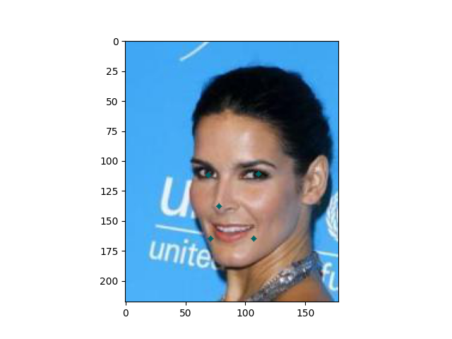
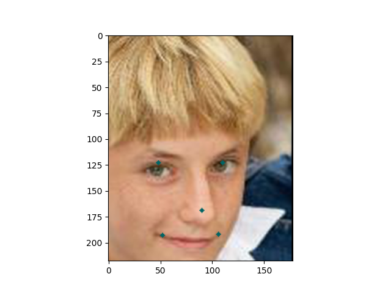
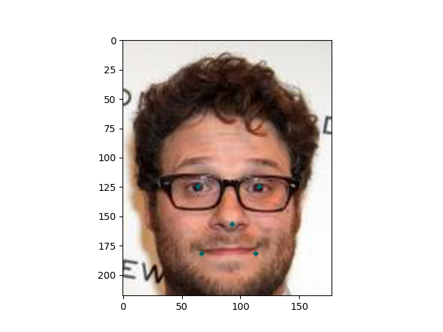
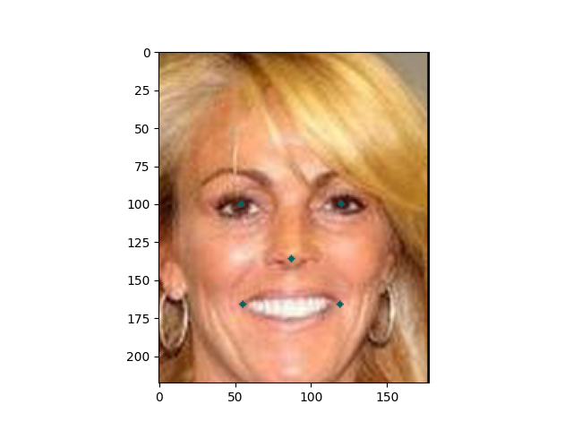
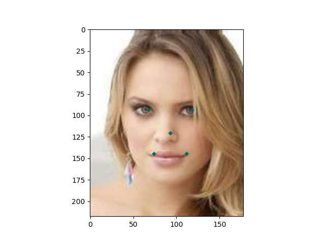
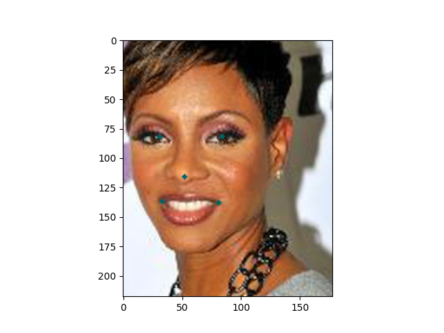
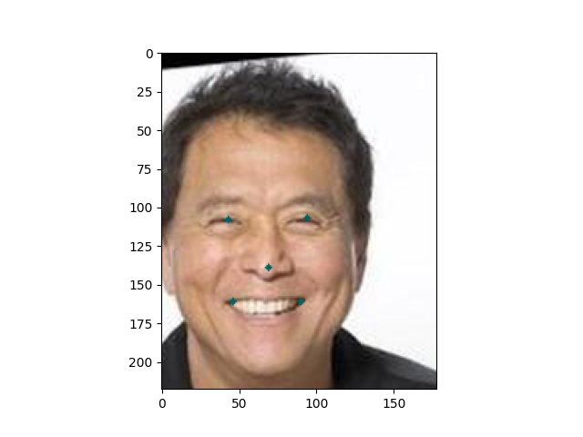
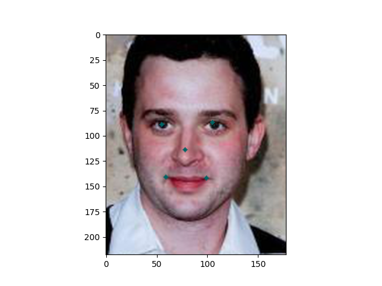

# Human Face Feature Classification
This repository allows you train a model on human features (eyes, nose, mouth, ...). It allows to you to test your model on some pictures. You can also run you model on you webcam or any video from the web. 

## Table of Contents
1. [Imports](#Imports) 
2. [What you need](#What-you-need)
3. [Image Results](#Image-Results)
4. [Video Results](#Video-Results)
5. [Additional Notes](#Additional-Notes)

## Imports
```
tensorflow                2.2.0
opencv-python             4.3.0.36
numpy                     1.18.5
scipy                     1.5.0
matplotlib                3.2.1
```

## What you need
- A dataset with the following dimentions HEIGHT, WIDTH = (218, 178), with feature annotations
    - I used the following https://drive.google.com/drive/folders/0B7EVK8r0v71pWEZsZE9oNnFzTm8
    - The dataset goes in ./humans/img_align_celeba
    - The features goes in ./list_landmarks_align_celeba.txt
    - Note that the data set is pretty big (5 million celeb images), I only used around 5000 to train the model

- ./haarcascade_frontalface_default.xml, you can find this online just search for it
- If you are going to train the model on video data you need ./videoData directory

## Image Results









## Video Results


## Additional Notes
Pictures generally performed very well. However with the videos there were a lot of inaccuracies. This was mainly due to the fact that the models input was restricted to a certain width and height. This caused the problems when in the video the face took up small proportion of the assigen width and height. So, if the face was relatively small in 218 x 178 input frame, the model got confused since it was trained mainly on images where the face occupied all of the input frame. In the future, using a dataset where was not restricted to just the face but also contained the subjects body / the surrounding environment. This would allow the model to perform better on the video input.

This model was trained on grayscale images and for futher improvement a coloured input could be beneficial.

The test_human_features.py file choses a random file out of the 5 million faces dataset. You can configure it to select images to your liking. Additionally, you can select which video to run in plot_features_on_video.py file through the following param:

```python
VID = os.path.join(ROOT, "videoData", "homealone.mp4")
```

Also, you can chose to run the model on the webcam by setting the following param in the plot_features_on_video.py file.

``` python
if __name__ == "__main__":
    detect_features(0)
```